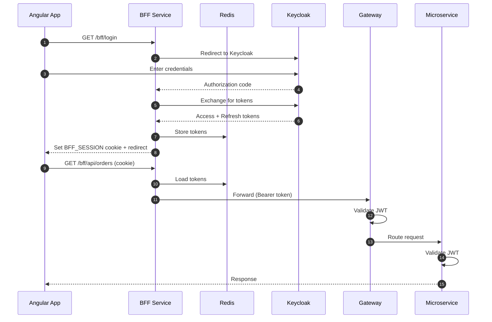
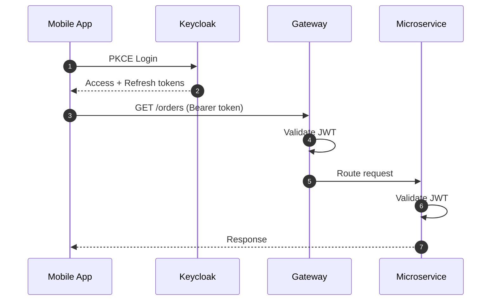
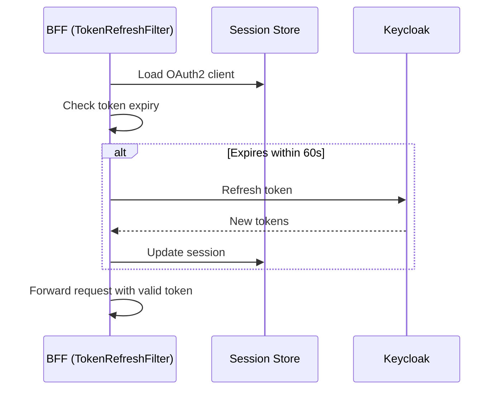

# Enterprise Spring Microservices Template

A production-ready secure microservices template using **Spring Boot 4.x**, **Keycloak**, and **Angular 18**. Designed to support both Web (BFF pattern) and Mobile (direct JWT) applications with enterprise-grade security.

---

## Table of Contents

- [Features](#features)
- [Architecture](#architecture)
- [Quick Start](#quick-start)
- [Project Structure](#project-structure)
- [Services](#services)
- [Security Patterns](#security-patterns)
- [API Reference](#api-reference)
- [Development](#development)
- [Documentation](#documentation)

---

## Features

- **Two-Lane Architecture** - Separate flows for Web (cookie-based) and Mobile (token-based) clients
- **BFF Pattern** - Backend-for-Frontend isolates OAuth2 complexity from the browser
- **Defense in Depth** - JWT validated at both Gateway and each microservice (Zero Trust)
- **Proactive Token Refresh** - 60-second buffer prevents mid-flight token expiration
- **Single Sign-Out (SLO)** - Complete logout across BFF sessions and Keycloak IdP
- **Rate Limiting** - Redis-backed token bucket algorithm at the Gateway
- **Circuit Breaker** - Resilience4j at Gateway and BFF for graceful failure handling
- **Distributed Tracing** - Micrometer Tracing with Zipkin for end-to-end request visibility
- **Centralized Logging** - Structured JSON logs with Loki aggregation and Grafana visualization
- **Prometheus Metrics** - JVM, HTTP, and circuit breaker metrics with Grafana dashboards
- **Robust API Error Handling** - Jakarta Validation on DTOs with standardized [RFC 7807 Problem Details](https://datatracker.ietf.org/doc/html/rfc7807) responses.
- **OpenAPI Documentation** - Swagger UI with Gateway aggregation
- **Angular 18 UI** - Modern standalone components with Angular Material
- **Keycloak Integration** - Enterprise identity provider with user management
- **Testcontainers** - Reliable integration testing with ephemeral databases

---

## Architecture

```
┌─────────────────────────────────────────────────────────────────────────────┐
│                              CLIENTS                                        │
├─────────────────────────────────┬───────────────────────────────────────────┤
│         Web Browser             │            Mobile App                     │
│      (Angular @ 4200)           │         (Flutter/Native)                  │
└────────────┬────────────────────┴───────────────────┬───────────────────────┘
             │ Cookie (BFF_SESSION)                   │ Bearer Token
             ▼                                        │
┌────────────────────────┐                            │
│   BFF Service (8081)   │                            │
│  ├─ OAuth2 Client      │                            │
│  ├─ Session (Redis)    │                            │
│  └─ Token Refresh      │                            │
└────────────┬───────────┘                            │
             │ Bearer Token                           │
             ▼                                        ▼
┌─────────────────────────────────────────────────────────────────────────────┐
│                        API Gateway (8888)                                   │
│                    JWT Validation (Defense Layer 1)                         │
└─────────┬─────────────────────┬─────────────────────┬───────────────────────┘
          │                     │                     │
          ▼                     ▼                     ▼
┌──────────────────┐   ┌──────────────────┐   ┌─────────────────┐
│ Profile Service  │   │  Order Service   │   │ Keycloak Admin  │
│     (8082)       │   │     (8083)       │   │    Service      │
│  JWT Validation  │   │  JWT Validation  │   │     (8084)      │
│ (Defense Layer 2)│   │ (Defense Layer 2)│   │                 │
└────────┬─────────┘   └────────┬─────────┘   └────────┬────────┘
         │                      │                      │
         ▼                      ▼                      ▼
┌─────────────────┐    ┌─────────────────┐    ┌─────────────────┐
│   PostgreSQL    │    │   PostgreSQL    │    │    Keycloak     │
│     (5433)      │    │     (5433)      │    │     (8080)      │
└─────────────────┘    └─────────────────┘    └─────────────────┘
```

---

## Quick Start

### Prerequisites

- Docker & Docker Compose
- Java 25
- Node.js 18+ (for Angular UI)
- Maven

### 1. Start Backend Services

```bash
./manage_services.sh start
```

This starts:
- Keycloak (http://localhost:8080)
- Zipkin (http://localhost:9411)
- Loki (http://localhost:3100)
- Grafana (http://localhost:3000)
- PostgreSQL databases
- Redis
- All Spring Boot services

### 2. Configure Keycloak (First Time Only)

The `admin-service-client` needs permissions to manage users:

1. Login to [http://localhost:8080/admin](http://localhost:8080/admin) (`admin` / `admin`)
2. Select **my-realm** (top-left dropdown)
3. Go to **Clients** → **admin-service-client** → **Service Account Roles**
4. Click **Assign Role** → Filter by **clients** → Select **realm-management**
5. Assign **manage-users** and **view-users** roles

### 3. Start Angular UI

```bash
cd angular-ui
npm install
npm start
```

### 4. Access the Application

| URL                                                 | Description                  |
|-----------------------------------------------------|------------------------------|
| http://localhost:4200                               | Angular Web UI               |
| http://localhost:8080/admin                         | Keycloak Admin Console       |
| http://localhost:8888/webjars/swagger-ui/index.html | API Documentation            |
| http://localhost:9411                               | Zipkin (Distributed Tracing) |
| http://localhost:9090                               | Prometheus (Metrics)         |
| http://localhost:3000                               | Grafana (Dashboards)         |

### 5. Login

- **Username:** `user`
- **Password:** `password`

---

## Project Structure

```
root_folder/
├── angular-ui/                 # Angular 18 Web Application
│   ├── src/app/
│   │   ├── core/               # Auth service, interceptors, guards
│   │   ├── features/           # Login, Dashboard, Profile, Orders
│   │   └── shared/             # Main layout with sidenav
│   └── proxy.conf.json         # Dev proxy to BFF
├── bff/                        # Backend-for-Frontend Service
├── gateway/                    # Spring Cloud Gateway
├── profile-service/            # User Profile Microservice
├── order-service/              # Order Management Microservice
├── keycloak-admin-service/     # Keycloak User Management Proxy
├── common-core/                # Shared constants and utilities (Zero dependencies)
├── common-web/                 # Shared web components (Exception handling)
├── common-security/            # Shared security config (Resource Server setup)
├── dependencies-bom/           # Dependency version management
├── docker/                     # Docker Compose configurations
├── docs/                       # Architecture documentation
└── manage_services.sh          # Service management script
```

### Shared Libraries

| Module            | Purpose         | Key Components                                               |
|-------------------|-----------------|--------------------------------------------------------------|
| `common-core`     | Constants       | `SecurityConstants`, `SessionConstants`                      |
| `common-web`      | Web utilities   | `GlobalExceptionHandler`, `TrailingSlashFilter`, Tracing     |
| `common-security` | Security config | `KeycloakJwtAuthenticationConverter`, `OpenApiConfigFactory` |

#### Dependency Inheritance

```
common-core (zero dependencies)
    │
    ├── Used by: common-web
    │
    └── common-web (+ Spring Web, Validation, Tracing)
            │
            ├── Used by: BFF, common-security
            │
            └── common-security (+ Spring Security, SpringDoc)
                    │
                    └── Used by: Profile Service, Order Service, Keycloak Admin
```

> **Note:** Gateway is standalone (Spring Boot 3.x) and doesn't use shared libraries.

---

## Services

| Service             | Port | Technology                     | Purpose                                    |
|---------------------|------|--------------------------------|--------------------------------------------|
| **Angular UI**      | 4200 | Angular 18, Material           | Web application                            |
| **BFF**             | 8081 | Spring Boot 4.x (MVC)          | OAuth2 client, session management          |
| **Gateway**         | 8888 | Spring Cloud Gateway (WebFlux) | API routing, JWT validation, rate limiting |
| **Profile Service** | 8082 | Spring Boot 4.x                | User profile CRUD                          |
| **Order Service**   | 8083 | Spring Boot 4.x                | Order management                           |
| **Keycloak Admin**  | 8084 | Spring Boot 4.x                | User provisioning proxy                    |
| **Keycloak**        | 8080 | Keycloak 24.x                  | Identity Provider                          |
| **PostgreSQL**      | 5433 | PostgreSQL 16                  | Application data                           |
| **PostgreSQL**      | 5432 | PostgreSQL 16                  | Keycloak data                              |
| **Redis**           | 6379 | Redis 7                        | BFF session storage, rate limiting         |
| **Zipkin**          | 9411 | Zipkin 3                       | Distributed tracing UI                     |
| **Prometheus**      | 9090 | Prometheus 2.51                | Metrics collection                         |
| **Loki**            | 3100 | Loki 3.0                       | Log aggregation                            |
| **Grafana**         | 3000 | Grafana 11.0                   | Metrics & logs visualization               |

> **Note on Gateway Stack:** The API Gateway runs on **Spring Boot 3.5.x (WebFlux)** instead of 4.x (MVC). This is a deliberate architectural choice to enable the built-in **Redis RequestRateLimiter**, which relies on the non-blocking Reactive stack. Upgrading the Gateway to MVC/Servlet stack would require a custom rate-limiting implementation.

---

## Observability

The project includes a complete observability stack for distributed tracing, centralized logging, and metrics collection.

### Components

| Tool           | Purpose                                                               | URL                   |
|----------------|-----------------------------------------------------------------------|-----------------------|
| **Zipkin**     | Distributed tracing - view request flows across services              | http://localhost:9411 |
| **Prometheus** | Metrics collection - scrapes `/actuator/prometheus` from all services | http://localhost:9090 |
| **Loki**       | Log aggregation - collects structured logs from all services          | http://localhost:3100 |
| **Grafana**    | Visualization - dashboards for metrics, logs, and traces              | http://localhost:3000 |

### Logging Profiles

All services support three logging profiles:

```bash
# Default: Console output with trace correlation
./manage_services.sh start

# JSON: Structured JSON logs (for production/log shippers)
SPRING_PROFILES_ACTIVE=json ./manage_services.sh start

# Loki: Push logs directly to Loki
SPRING_PROFILES_ACTIVE=loki ./manage_services.sh start
```

Log format includes trace correlation: `[traceId, spanId]` for linking logs to distributed traces.

### Grafana Dashboards

Pre-provisioned **Spring Boot Services** dashboard includes:
- HTTP request rate and response times (p95, p99)
- JVM heap memory and thread counts
- Circuit breaker state and failure rates
- CPU usage and service uptime

**Credentials:** admin / admin

### Trace Propagation

TraceId flows through the entire request chain:
```
Browser → BFF → Gateway → Microservice
         [same traceId propagated via headers]
```

View in Zipkin to see timing breakdown across services.

---

## Security Patterns

### Web Application Flow (BFF Pattern)



### Mobile Application Flow



### Proactive Token Refresh

The BFF checks token expiration before each request. If the token expires within 60 seconds, it proactively refreshes to prevent mid-flight expiration.



---

## Frontend Integration & Session Management

### Dual Session Strategy
The BFF maintains two distinct sessions for the Web Client:
1.  **Spring Security Session (`JSESSIONID`)**: Used only for the `/bff/user` endpoint to return OIDC identity claims (email, name).
2.  **BFF Custom Session (`BFF_SESSION`)**: A signed JWT cookie used for all `/bff/api/**` proxy requests. This maps to the actual Access Tokens stored in Redis.

**Why?** This separation allows the proxy logic to be stateless and robust (handling token refresh manually) while leveraging standard Spring Security for the initial OAuth2 login flow.

### AJAX Request Handling (401 vs Redirect)
By default, Spring Security redirects unauthenticated requests to the login page. This breaks AJAX calls in Single Page Applications (SPAs).

**Requirement:** The Angular application **MUST** send the following header with every HTTP request:
```http
X-Requested-With: XMLHttpRequest
```

**Behavior:**
*   **Browser Navigation:** Redirects to Keycloak Login.
*   **AJAX (with Header):** Returns `401 Unauthorized`. The Angular `AuthInterceptor` detects this and redirects the user to login programmatically.

### Single Sign-Out (SLO)
A single request to `/bff/logout` performs a comprehensive sign-out across all layers:
1.  **Local & Session Cleanup:** Deletes the Redis session, invalidates the `JSESSIONID`, and clears both `BFF_SESSION` and `JSESSIONID` cookies.
2.  **Identity Provider Logout:** Automatically redirects the browser to Keycloak's logout endpoint to terminate the SSO session, ensuring the user is fully logged out of the IdP.

### URL Transformation Journey

Requests pass through multiple layers, each transforming the URL:

**Example: Get User Profile (Authenticated)**
```
Angular UI
    │ GET /bff/api/profile
    ▼
BFF (8081)
    │ Validates BFF_SESSION cookie
    │ Loads OAuth tokens from Redis
    │ Transforms: /bff/api/profile → /profile
    │ Adds: Authorization: Bearer <token>
    ▼
Gateway (8888)
    │ Validates JWT
    │ Applies: StripPrefix=1, PrefixPath=/api
    │ Transforms: /profile → /api/profile
    ▼
Profile Service (8082)
    │ Validates JWT (defense in depth)
    │ Handles: /api/profile
    ▼
Response flows back through each layer
```

**Example: Public Registration (Unauthenticated)**
```
Angular UI
    │ POST /bff/public/profile/register
    ▼
BFF (8081)
    │ No auth required (public endpoint)
    │ Transforms: /bff/public/profile/register → /profile/public/register
    ▼
Gateway (8888)
    │ No JWT required (matches /*/public/**)
    │ Applies: StripPrefix=1, PrefixPath=/api
    │ Transforms: /profile/public/register → /api/public/register
    ▼
Profile Service (8082)
    │ Handles: /api/public/register (permitAll)
    ▼
Response flows back
```

**Summary Table:**

| Layer   | Input                          | Output                     | Transformation                     |
|---------|--------------------------------|----------------------------|------------------------------------|
| BFF     | `/bff/api/profile`             | `/profile`                 | Strip `/bff/api`, use service name |
| BFF     | `/bff/public/profile/register` | `/profile/public/register` | Strip `/bff`, reorder path         |
| Gateway | `/profile`                     | `/api/profile`             | StripPrefix=1, PrefixPath=/api     |
| Gateway | `/profile/public/register`     | `/api/public/register`     | StripPrefix=1, PrefixPath=/api     |

---

## API Reference

### Web Endpoints (via BFF)

| Method | Endpoint           | Description              |
|--------|--------------------|--------------------------|
| GET    | `/bff/login`       | Initiate OAuth2 login    |
| GET    | `/bff/logout`      | Logout and clear session |
| GET    | `/bff/user`        | Get current user info    |
| GET    | `/bff/api/profile` | Get user profile         |
| POST   | `/bff/api/profile` | Create user profile      |
| DELETE | `/bff/api/profile` | Delete user profile      |
| GET    | `/bff/api/orders`  | List orders              |
| POST   | `/bff/api/orders`  | Create order             |

### Public Endpoints (no authentication)

| Method | Endpoint                                | Description                |
|--------|-----------------------------------------|----------------------------|
| POST   | `/bff/public/profile/register`          | Register new user          |
| GET    | `/bff/public/profile/confirm?token=xxx` | Confirm email registration |

Note: Public endpoints follow the pattern `/bff/public/{service}/{path}` which maps to `/{service}/public/{path}` at the gateway, then to `/api/public/{path}` at the service (simplified routing strips the service name).

### Mobile Endpoints (via Gateway)

```bash
# Get access token
curl -X POST http://localhost:8080/realms/my-realm/protocol/openid-connect/token \
  -d "client_id=bff-client" \
  -d "client_secret=mysecret" \
  -d "grant_type=password" \
  -d "username=user" \
  -d "password=password"

# Call API
curl -H "Authorization: Bearer <TOKEN>" http://localhost:8888/profile
```

### Error Responses (RFC 7807)

All API errors return standardized [Problem Details](https://datatracker.ietf.org/doc/html/rfc7807) format:

```json
{
  "type": "about:blank",
  "title": "Input Validation Error",
  "status": 400,
  "detail": "Validation Failed",
  "errors": {
    "email": "Invalid email format",
    "age": "Age must be a positive number"
  }
}
```

| Status | Title                  | When                                              |
|--------|------------------------|---------------------------------------------------|
| 400    | Input Validation Error | Request body fails DTO validation                 |
| 401    | Unauthorized           | Missing or invalid JWT                            |
| 404    | Not Found              | Resource doesn't exist                            |
| 409    | Conflict               | Resource already exists (e.g., duplicate profile) |
| 500    | Internal Server Error  | Unexpected server error (sanitized in production) |

---

## Development

### Commands

```bash
./manage_services.sh start     # Start all services
./manage_services.sh stop      # Stop all services
./manage_services.sh restart   # Restart services
./manage_services.sh test      # Run tests
```

### Angular Development

```bash
cd angular-ui
npm start                      # Start dev server with proxy
npm run build                  # Production build
npm test                       # Run tests
```

### Tech Stack

| Layer         | Technology                                           |
|---------------|------------------------------------------------------|
| Frontend      | Angular 18, Angular Material, RxJS, Signals          |
| BFF           | Spring Boot 4.x (MVC), Spring Security OAuth2 Client |
| Gateway       | Spring Cloud Gateway WebFlux (Spring Boot 3.x)       |
| Services      | Spring Boot 4.x (MVC), Spring Data JPA               |
| Identity      | Keycloak 24.x                                        |
| Database      | PostgreSQL 16                                        |
| Cache         | Redis 7                                              |
| Tracing       | Micrometer Tracing, Zipkin 3                         |
| Metrics       | Micrometer, Prometheus                               |
| Logging       | Logback, Logstash Encoder, Loki                      |
| Visualization | Grafana (dashboards for metrics, logs, traces)       |
| Resilience    | Resilience4j (Circuit Breaker)                       |
| Testing       | JUnit 5, Testcontainers, Jasmine                     |

---

## Documentation

| Document                                                  | Description                                    |
|-----------------------------------------------------------|------------------------------------------------|
| [Production Readiness](docs/PRODUCTION_CHECKLIST.md)      | Checklist for production deployment            |
| [User Registration](docs/user_registration_flow.md)       | Self-registration flow with email confirmation |
| [BFF Comparison](docs/bff_comparison_analysis.md)         | Why decoupled BFF over gateway-integrated      |
| [Defense in Depth](docs/defense_in_depth_vs_perimeter.md) | Zero Trust architecture rationale              |
| [Token Refresh](docs/proactive_token_refresh.md)          | Proactive refresh strategy                     |
| [Dual Session Strategy](docs/dual_session_strategy.md)    | Internal vs External session management        |
| [AJAX Request Handling](docs/ajax_request_handling.md)    | 401 vs 302 Redirect logic                      |
| [Development Roadmap](docs/TODO.md)                       | Development Roadmap                            |

### Keycloak Configuration

| Setting       | Value                  |
|---------------|------------------------|
| Realm         | `my-realm`             |
| BFF Client    | `bff-client`           |
| Admin Client  | `admin-service-client` |
| Test User     | `user` / `password`    |
| Admin Console | `admin` / `admin`      |

---

## Author & Maintainer

**Mohammad Awwaad**  
*Senior Technical Architect* @ **InnovAxons**  
GitLab: [@mawwaad](https://gitlab.com/mawwaad)

## License

Distributed under the MIT License. See [LICENSE](LICENSE) for more information.
