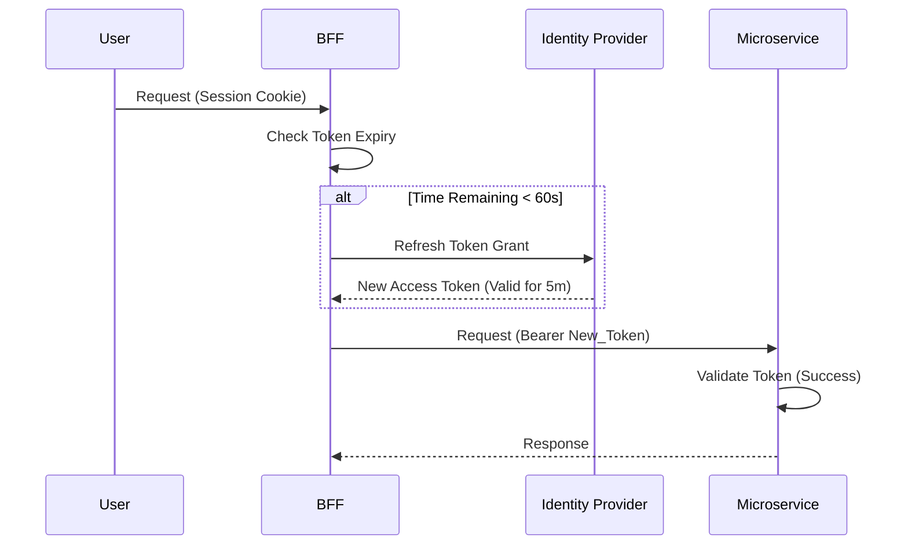

# Perimeter Security vs. Defense in Depth: A Modern Microservices Perspective

In the evolution of software architecture, security strategies have shifted fundamentally. This document explores the transition from traditional **Perimeter Security** (Castle-and-Moat) to **Defense in Depth** (Zero Trust), explaining why modern cloud-native applications—and tech giants like Google—champion the latter.

## 1. The Paradigms

### Perimeter Security (Castle-and-Moat)
Historically, security focused on "hard shells and soft centers."
*   **Concept:** Secure the network boundary (firewalls, VPNs, API Gateways). Once a request is inside the private network, it is trusted implicitly.
*   **Mechanism:** The Gateway validates the user's token. Downstream services talk to each other via HTTP/TCP without re-validating identity, often assuming "if it came from the internal network, it's safe."

### Defense in Depth (Zero Trust)
Modern security assumes "breach is inevitable" or "the network is hostile."
*   **Concept:** Never trust, always verify. Every component, regardless of its location in the network architecture, enforces security controls.
*   **Mechanism:** The Gateway validates the token *AND* every downstream microservice independently validates the token again. Identity is propagated and checked at every hop.

---

## 2. Comparison: Pros & Cons

| Feature              | Perimeter Security                                                                                     | Defense in Depth (Zero Trust)                                                                               |
|:---------------------|:-------------------------------------------------------------------------------------------------------|:------------------------------------------------------------------------------------------------------------|
| **Implementation**   | **Simpler.** Centralized auth logic at the Gateway only.                                               | **Complex.** Every service needs security config and JWKS validation logic.                                 |
| **Performance**      | **Faster.** Validated once; internal traffic is raw speed.                                             | **Slower.** Each hop incurs a cryptographic signature check (minimal with local JWKS caching).              |
| **Lateral Movement** | **High Risk.** If an attacker breaches one service, they can freely attack others.                     | **Low Risk.** An attacker inside the network still needs valid credentials to talk to other services.       |
| **Identity Context** | **Lost.** Downstream services often don't know *who* the user is, only that the Gateway approved them. | **Preserved.** The JWT travels with the request, giving every service full user context (roles, email, ID). |
| **Scalability**      | **Bottleneck.** The Gateway becomes a "God object" handling all security rules.                        | **Distributed.** Security rules are defined close to the data they protect.                                 |

---

## 3. Why Defense in Depth is Preferred

Modern architectures favor Defense in Depth for several compelling reasons:

1.  **The "Soft Center" is a Myth:** Cloud networks (AWS, GCP, Azure) are shared infrastructure. You cannot guarantee that "internal" traffic is actually isolated.
2.  **Lateral Movement Prevention:** In a microservices mesh, a vulnerability in a minor service (e.g., a logging utility) shouldn't grant admin access to the payment service. Zero Trust prevents this.
3.  **Google's Stance (BeyondCorp):** Google pioneered this shift with [BeyondCorp](https://cloud.google.com/beyondcorp). Their core thesis is: **"Connect from a particular network must not determine which services you can access."** Access depends on **who** you are (Identity) and the **context** of your request, not **where** you are physically plugged in.

---

## 4. The "Expired Token" Challenge

Implementing Defense in Depth introduces a specific distributed systems problem: **Mid-Flight Token Expiration**.

### The Scenario
1.  **Gateway:** A user sends a request. The Access Token is valid (expires in 1 second). Gateway passes it.
2.  **Network/Processing:** The request takes 2 seconds to reach Service A or be processed by it.
3.  **Service A:** Service A receives the request. It validates the token.
4.  **Failure:** The token is now **Expired**. Service A rejects it with `401 Unauthorized`.

In a Perimeter Security model, this wouldn't happen because Service A wouldn't check the token. In Defense in Depth, legitimate requests fail randomly near the end of a session.

### The Solution: Proactive Token Refresh

To overcome this, we implement a **Proactive Token Refresh** pattern, typically in the Backend-for-Frontend (BFF) or the Client Application.

**How it works:**
1.  **Buffer Zone:** Define a safety buffer (e.g., 60 seconds).
2.  **Check:** Before forwarding a request to the backend, the BFF checks the token's `exp` (expiration) claim.
3.  **Refresh:** If `(Expiration - Current Time) < Buffer`, the BFF **automatically** performs a Refresh Token flow with the Identity Provider to get a fresh Access Token.
4.  **Forward:** The BFF forwards the **new** token to the Gateway and Microservices.

**Result:** The downstream services (Gateway + Service A + Service B) are guaranteed to receive a token with at least 60 seconds of life remaining, eliminating random 401 errors due to network latency.

